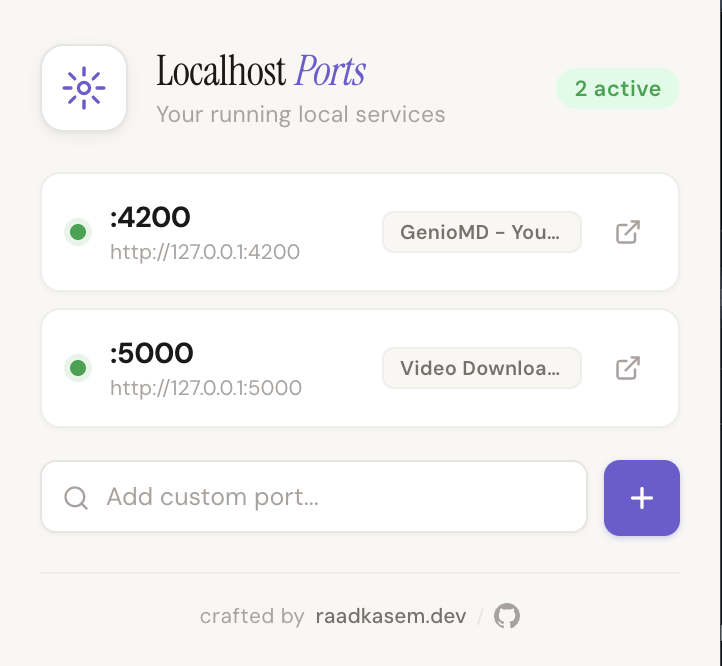

# Localhost Ports Dashboard

Chrome extension that scans your localhost ports and shows all running services — open any of them with one click.

## Features

- Auto-scans 17 common dev ports (React, Vite, Angular, Django, MySQL, Redis, etc.)
- Green dot indicator for active services
- One-click open in new tab
- Add and persist custom ports
- Labels auto-detected by port number

## Screenshot

  

## Install

1. Clone or download this repo
2. Open `chrome://extensions`
3. Enable **Developer mode**
4. Click **Load unpacked** and select the project folder

## License

[MIT](LICENSE)

## Author

**Raad Kasem** — [raadkasem.dev](https://raadkasem.dev) · [GitHub](https://github.com/raadkasem)
