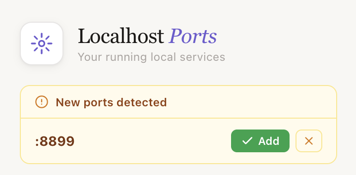

# Localhost Ports Dashboard

Chrome extension that scans your localhost ports and shows all running services — open any of them with one click.

## Features

- Auto-scans 13 common dev ports (React, Vite, Angular, Django, etc.)
- Probes both `127.0.0.1` and `localhost` — uses whichever responds
- Auto-detects service name from page title
- Auto-discovers new ports when you visit any localhost URL in the browser
- Badge notification for newly detected ports with Add/Dismiss options
- One-click open in new tab
- Add and persist custom ports
- Elegant light theme UI

## Screenshot

  

### Auto-discovers new ports

When you visit any localhost URL on an unknown port, the extension detects it and prompts you to add it.

  

## Install

1. Clone or download this repo
2. Open `chrome://extensions`
3. Enable **Developer mode**
4. Click **Load unpacked** and select the project folder

## License

[MIT](LICENSE)

## Author

**Raad Kasem** — [raadkasem.dev](https://raadkasem.dev) · [GitHub](https://github.com/raadkasem)
